**Course:** AIMLCZG523 — MLOps
**Repository:** https://github.com/axle-bits/MLOP_Assignment_1

## 1. Overview & Setup

This project builds an end-to-end MLOps pipeline around a binary classifier
that predicts heart disease risk from 13 clinical features in the UCI
Cleveland dataset. The goal was to evidence every stage of a production ML
lifecycle: reproducible data preparation, tracked experimentation, automated
testing and CI/CD, containerized serving, Kubernetes deployment, and
monitoring. Every non-trivial choice along the way is recorded and justified
below, not assumed.

The system is organized around a stage-oriented repository layout:
`ml/` (data and model code), `api/` (FastAPI service), `infra/` (Docker and
Kubernetes manifests), `tests/`, `notebooks/`, and `docs/`. This layout maps
1:1 onto the CI/CD stages (lint, test, build) and stays clearly distinct
from the widely-copied cookiecutter-data-science template. Data flows from
the UCI source through a cleaning step into a scikit-learn pipeline that
performs feature engineering, scaling, and encoding; the trained pipeline
is exported as a versioned artifact, wrapped in a FastAPI service, packaged
into a Docker image, deployed to a local Kubernetes cluster, and observed
through a Prometheus/Grafana stack. The architecture is summarized below.

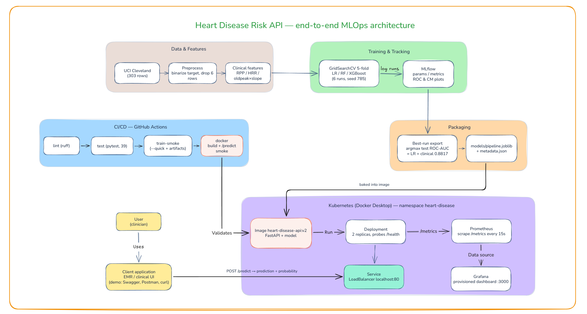

**Quickstart.** Clone the repository, create a virtual environment, and
install pinned dependencies:

```bash
python -m venv .venv && .venv/Scripts/activate
pip install -r requirements.txt
```

Train and track experiments, then serve locally:

```bash
python -m ml.models.train
uvicorn api.main:app --reload --port 8000
```

Or run containerized and on Kubernetes:

```bash
docker build -t heart-disease-api -f infra/Dockerfile .
docker run -d -p 8000:8000 heart-disease-api
kubectl apply -f infra/k8s/
```

Run the test suite before touching anything else with `pytest`, to confirm
the data pipeline and packaging logic behave as committed. `ruff check .`
runs the same lint gate CI enforces. The remaining sections follow the
same order as the assignment's nine tasks, from data through monitoring,
and each closes with the trade-offs actually made, not an idealized
version of the pipeline.

## 2. Data & EDA

The dataset is the classic Cleveland subset of the UCI Heart Disease
repository, fetched programmatically via `ucimlrepo` (id=45) instead of a
manual CSV download. This was verified to return exactly 303 rows × 13
features and matches the assignment's dataset link; the alternative
combined four-site dataset (~920 rows) was rejected because it is not what
id=45 actually serves. The raw multi-class target `num` (0–4, distribution
164/55/36/35/13) was binarized to 0 (no disease) vs 1 (disease present),
the established 0-vs-rest convention for this dataset and a binary
classifier requirement from the assignment itself.

Six rows (2% of the data) with missing `ca` (4 rows) or `thal` (2 rows)
values were dropped instead of imputed. Both are categorical clinical
measurements (vessel count, thalassemia type), and imputing them would
invent clinical facts; dropping also sidesteps any train/test leakage
question entirely. This leaves 297 rows with a class balance of 160
no-disease vs 137 disease cases, a mild imbalance handled downstream by
scoring on ROC-AUC.

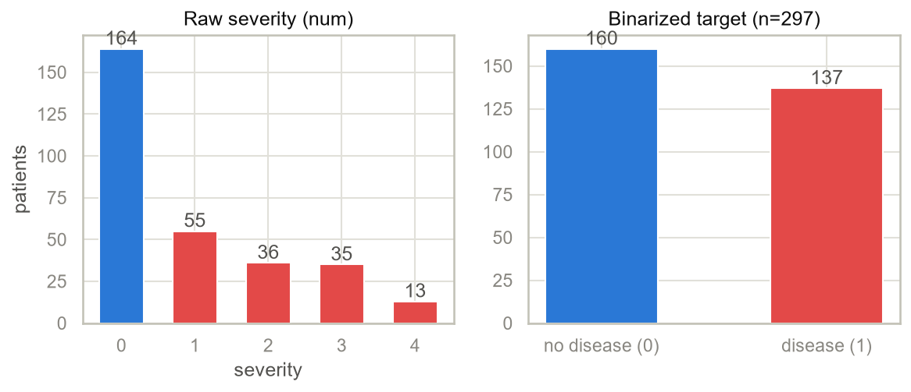
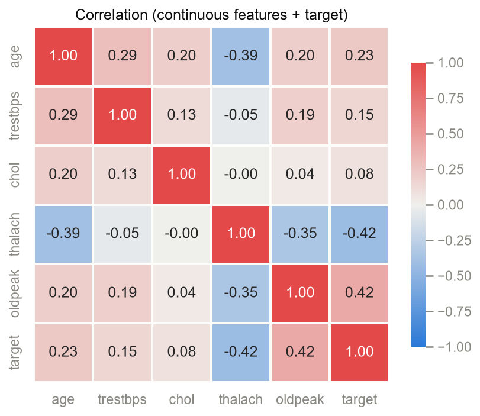
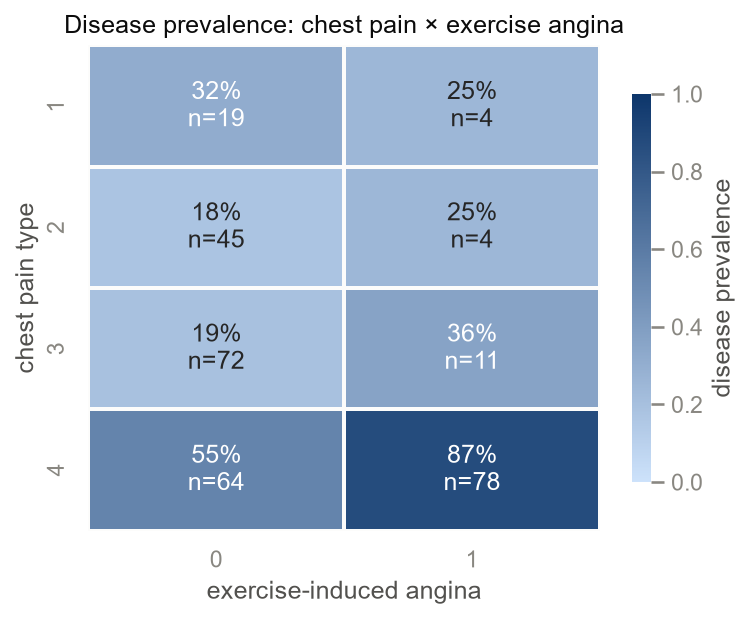

Exploratory analysis surfaced several clinically sensible patterns. Disease
prevalence is higher in males (56%) than females (26%). Patients
reporting asymptomatic chest pain combined with exercise-induced angina
show an 87% prevalence, the strongest subgroup signal in the data. Among
continuous features, ST-depression (`oldpeak`, r=+0.42) and maximum
heart rate achieved (`thalach`, r=−0.42) are the strongest linear
correlates of the target. These findings motivated the derived clinical
features introduced in the next section.

The figures themselves use a fixed two-class palette: no-disease blue
`#2a78d6`, disease red `#e34948`, a diverging blue-gray-red scale for the
correlation heatmap, and a single-hue blue ramp for prevalence heatmaps.
The palette was validated colorblind-safe with a worst-pair contrast well
above the accessibility threshold, instead of leaving the choice to
seaborn's defaults. This keeps every chart in the notebook and the report
visually consistent and legible.

## 3. Feature Engineering & Models

Three clinically motivated derived features were added inside the
scikit-learn `Pipeline` itself, not pre-computed into the cleaned CSV: the
rate-pressure product (`trestbps × thalach`), heart-rate reserve
(`220 − age − thalach`), and an `oldpeak × slope` interaction. Computing
them inside the pipeline guarantees an identical transformation at training
and inference time. A fourth candidate, pulse pressure, was rejected
outright: the dataset only carries systolic blood pressure (`trestbps`),
with no diastolic column to pair it with.

Preprocessing applies `StandardScaler` to the five continuous features plus
`ca` (treated numerically as an ordinal vessel count, not a nominal code)
and the three derived features when enabled. `OneHotEncoder` with
`handle_unknown="ignore"` handles the nominal categoricals `cp`,
`restecg`, `slope`, `thal`, and the binary features `sex`, `fbs`, `exang`
pass through unchanged. This keeps dimensionality low on a 297-row dataset
while protecting inference-time inputs from unseen category codes.

Three model families, Logistic Regression, Random Forest, and XGBoost,
were each trained on two feature sets (raw vs. raw+clinical), giving six
tracked runs. Every run used `GridSearchCV` over `StratifiedKFold(5,
shuffle=True)`, scoring ROC-AUC, tuned only on an 80/20 stratified train
split. A `random_state=785` (a seed derived from the student ID) was
shared across all runs so that differences are attributable to model and
features alone; the test split is touched exactly once per run to avoid
selection leakage. Metrics logged include CV mean±std ROC-AUC plus
held-out accuracy, precision, recall, F1, and ROC-AUC.

`GridSearchCV` was preferred over `RandomizedSearchCV` because the six
grids are small enough to enumerate exhaustively. Nested cross-validation
was judged more rigorous than necessary for 297 rows and harder to present
clearly. The seed `random_state=785` was chosen over the tutorial-universal
42 for originality; this has no effect on the validity of the comparison
since it is applied identically to every run. A third model family,
XGBoost, was added beyond the assignment's two-model minimum to make this
comparison richer.

| model | features | cv_roc_auc | test_accuracy | test_precision | test_recall | test_f1 | test_roc_auc |
|---|---|---|---|---|---|---|---|
| logistic_regression | clinical | 0.9195 ± 0.0123 | 0.7667 | 0.7500 | 0.7500 | 0.7500 | **0.8817** |
| logistic_regression | raw | 0.9198 ± 0.0230 | 0.7833 | 0.7778 | 0.7500 | 0.7636 | 0.8761 |
| random_forest | raw | 0.9238 ± 0.0149 | 0.7833 | 0.7586 | 0.7857 | 0.7719 | 0.8583 |
| random_forest | clinical | 0.9148 ± 0.0206 | 0.7667 | 0.7917 | 0.6786 | 0.7308 | 0.8493 |
| xgboost | clinical | 0.9313 ± 0.0115 | 0.6833 | 0.6552 | 0.6786 | 0.6667 | 0.8415 |
| xgboost | raw | 0.9242 ± 0.0196 | 0.7500 | 0.6970 | 0.8214 | 0.7541 | 0.8315 |

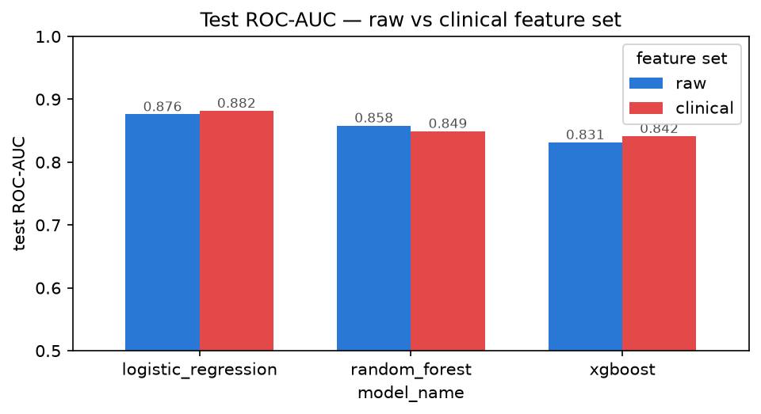

The winning configuration is Logistic Regression with the clinical feature
set: test ROC-AUC 0.8817, CV 0.9195 ± 0.0123. The honest picture is mixed,
not uniformly positive. The clinical features helped Logistic Regression
(0.8817 vs 0.8761 raw) but slightly hurt Random Forest (0.8493 vs 0.8583
raw). Tree ensembles can already capture the interactions the derived
features encode, so handing them a redundant, correlated copy of that
signal did not pay off, and in Random Forest's case cost a little.

## 4. Experiment Tracking

All six runs are tracked with MLflow, using a `sqlite:///mlflow.db` store
for run metadata (params, metrics, tags) with artifacts under `./mlruns`.
Each run logs its hyperparameters, seven metrics (CV mean/std ROC-AUC plus
test accuracy, precision, recall, F1, ROC-AUC), the ROC curve, confusion
matrix, and feature-importance plots as artifacts, and the fitted pipeline
itself in MLflow's model format. This gives a complete, comparable record
across all 3-model × 2-feature-set combinations without re-running
anything to answer "did the clinical features help."

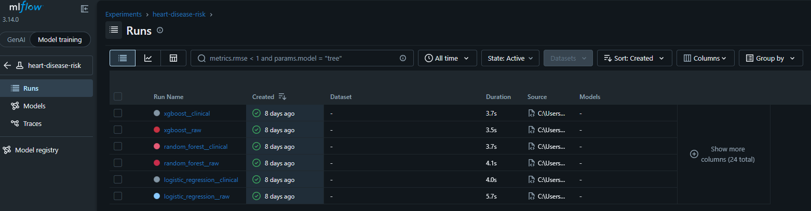
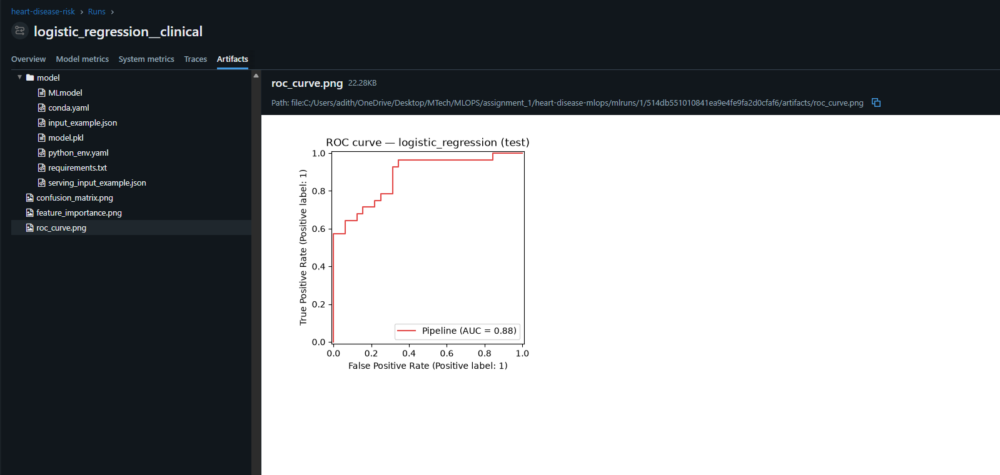

Getting there required adapting to genuine behavioral changes in the
pinned MLflow 3.14.0, which differs from the version the original brief
assumed. MLflow 3.x now raises on any `file://`/`./mlruns`-only tracking
URI unless `MLFLOW_ALLOW_FILE_STORE=true` is set, since the pure file
store is in maintenance mode. The fix was to point the tracking URI at
`sqlite:///mlflow.db` (metadata) with `./mlruns` retained only as the
artifact root, confirmed by inspecting which store actually held the six
runs' params and metrics.

Separately, `mlflow.sklearn.log_model()` in 3.x now records the model as a
decoupled "LoggedModel" that never appears under the run's own artifact
tree, and the model pipeline's `FunctionTransformer` (wrapping the
first-party clinical-feature function) is rejected by the new default
`skops` serialization as an "untrusted type." Both issues were resolved
together by saving the model to a temp directory with
`serialization_format="cloudpickle"` and uploading it as a run artifact
directly. This restores the classic run-scoped `model/` folder and keeps
the custom transformer loadable, verified end-to-end by reloading each
run's model with `mlflow.sklearn.load_model` and calling `.predict()`.

## 5. Packaging & Reproducibility

The best run is selected deterministically as the argmax of test ROC-AUC
over the full-grid runs, which the fixed seed makes reproducible. It is
exported in two formats: `models/heart_disease_pipeline.joblib`, the
canonical serving artifact loadable with scikit-learn and joblib alone
(no MLflow dependency at inference time), and `models/mlflow_model/`, the
same pipeline in MLflow's own format for that deliverable. A companion
`model_metadata.json` records the source run id, its metrics, package
versions, and the expected input schema, so a fresh clone or a grader can
verify provenance without access to the MLflow store. All three are
committed to git alongside a fully pinned `requirements.txt`, so serving
and the CI pipeline work from a clean checkout with no retraining required.
Pickle version-fragility is mitigated by pinning dependency versions and
recording them explicitly in the metadata file.

Reproducibility was also treated as something to verify, not assume.
Adding scikit-learn, xgboost, mlflow, and joblib to `requirements.txt` and
re-freezing with exact `==` pins surfaced that installing MLflow forces
pandas down from 3.0.3 to 2.3.3, because MLflow 3.14.0 declares
`Requires-Dist: pandas<3`. That conflict was confirmed directly
(`pip install --dry-run` against the newer pandas raised
`ResolutionImpossible`), and the full test suite was re-run against the
downgraded pin before committing it. The pinned set is a verified
mutually-compatible combination, not an assumed one.

## 6. CI/CD

The GitHub Actions pipeline (`.github/workflows/ci.yml`) runs four jobs on
every push and pull request: **lint** (`ruff check .` — pycodestyle errors,
pyflakes, import order) and **test** (the full pytest suite, JUnit results
uploaded as an artifact even on failure) run in parallel, followed by
**train-smoke** (`python -m ml.models.train --quick`, exercising all six
model/feature combinations end-to-end with quick grids, log and tracking
store uploaded as artifacts), and a **docker** build-validation job. Jobs
carry timeouts and read-only permissions by default, and artifacts are
uploaded on every run (`if: always()`) so logs are available exactly when
a run fails and they matter most. Linting runs a single tool, ruff,
configured for pycodestyle errors, pyflakes, and import order with a
100-character line length. The smoke job does not run the export step,
since the pipeline's own `pick_best` logic rejects quick-mode runs by
design, and carving out a CI-only bypass would weaken that guarantee
instead of testing it; export correctness is instead covered by unit
tests in the test job. Python is pinned to 3.13 across CI and the serving
image because the committed model pickle was built under 3.13.11, and
cross-minor-version unpickling is the most realistic way a pipeline like
this actually breaks.

To demonstrate the gate is real, not decorative, a deliberately broken
commit was pushed to trigger a red run. The test job fails, causing the
downstream train-smoke and docker jobs to be skipped (they depend on
test), while lint still passes independently. The pipeline reports
failure with the failing assertion visible in the logs. The fix was then
pushed to restore a green run.

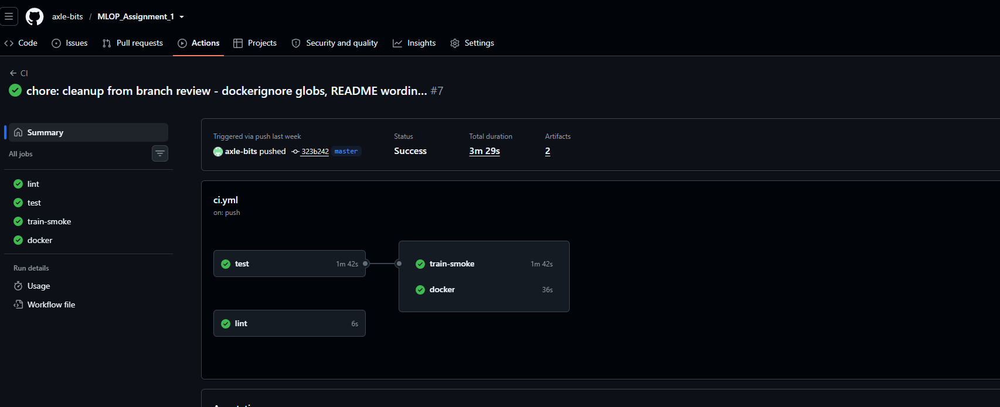
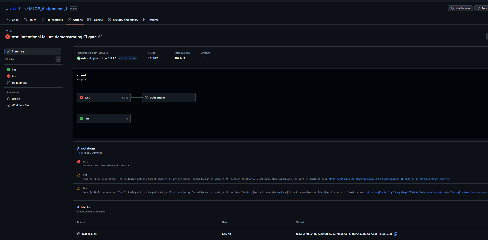

## 7. Containerization

The serving image installs only `api/requirements.txt`: FastAPI, uvicorn,
scikit-learn, pandas, numpy, joblib, prometheus-client, and
prometheus-fastapi-instrumentator, eight pins mirrored from the root
`requirements.txt`. It then copies in `ml/`, `models/`, and `api/`, and
excludes MLflow, XGBoost, and the plotting stack, since the exported
joblib pipeline only needs scikit-learn, pandas, and the `ml` package at
inference time. This roughly halves the image size relative to installing
the full training requirements and shrinks the attack surface. The image
runs as a non-root user on a `python:3.13-slim` base (matching the Python
version the committed pickle was built under) with a `HEALTHCHECK`
against `/health`.

Local proof: the image was built and run with `docker run -d -p 8000:8000
heart-disease-api`; `/health` returned `{"status":"ok","model_loaded":true}`
and a `/predict` call against the sample request returned a prediction with
probability 0.3326, both confirmed against the container's own logs
(full transcript in `docs/figures/api/local_container_proof.md`).

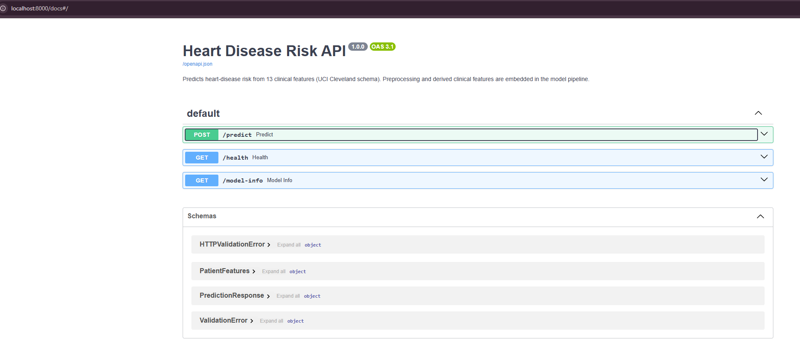

The `/predict` schema itself enforces the UCI data dictionary strictly at
the API boundary: enums for categorical codes (`cp` 1–4, `thal` {3,6,7},
`ca` 0–3, the various binary flags) and bounded ranges for continuous
clinical values (age 18–100, resting blood pressure 80–220, cholesterol
100–600, max heart rate 60–220, `oldpeak` 0–7). Anything outside those
bounds is rejected with a structured 422 instead of being accepted. This
is stricter than the pipeline itself needs to be: the fitted pipeline's
`OneHotEncoder(handle_unknown="ignore")` would silently zero-out an
unrecognized category code and still return a prediction, which is
tolerable for batch scoring but not for a clinical-facing endpoint, where
silent garbage-in is worse than an explicit rejection. The pipeline's own
tolerance is kept as a second line of defense underneath the API-level
validation.

## 8. Deployment

The deployment target was originally planned as AWS EKS with ECR as the
registry. That plan changed on account-constraint grounds, not preference.
The available AWS account cannot create IAM roles and cannot expose public
services; it is confined to a private VPC with only private subnets, and
`eksctl` provisions IAM roles via CloudFormation as part of cluster
creation, so EKS cluster creation fails outright under those guardrails.
Instead of fighting the account boundary, the deployment target was
pivoted to Docker Desktop's built-in Kubernetes cluster. This is a
constraint-driven decision explicitly accepted by the assignment FAQ
(which allows Minikube/Docker Desktop and local access instructions in
place of a public URL), and it satisfies the rubric fully: Deployment and
Service YAML, LoadBalancer exposure, verifiable endpoints, all with zero
account risk. Two alternatives were weighed and set aside. EKS against
pre-existing IAM roles with an internal load balancer had feasibility
that could not be verified inside the restricted account, since every
step would have to be relayed through a SageMaker terminal with no direct
visibility. ECS in the account's private subnets is permitted, but it
produces a task-definition artifact instead of the Kubernetes
Deployment/Service YAML the FAQ and rubric expect: a technically working
answer to a different question.

The manifests define a `heart-disease` namespace, a 2-replica Deployment
with readiness and liveness probes against `/health` (Kubernetes ignores
the Dockerfile `HEALTHCHECK`, so the probes are the real gate; with the
model loaded at import time, a pod with a broken artifact never becomes
Ready), and a `LoadBalancer` Service mapping port 80 to the pods' 8000. The
image is consumed from the local Docker image store
(`imagePullPolicy: IfNotPresent`), with no registry involved.

Verification on a live 2-node cluster (`desktop-control-plane`,
`desktop-worker`, v1.36.1) confirmed both nodes `Ready` and both pods
`Running` with `READY 1/1`; `curl http://localhost/health` and a `/predict`
call both succeeded through the LoadBalancer Service. A rolling-restart
demo (`kubectl rollout restart`) issued six consecutive health-check
requests during the restart — all returned `200` — confirming zero-downtime
rollout while both pods were replaced with fresh ones.

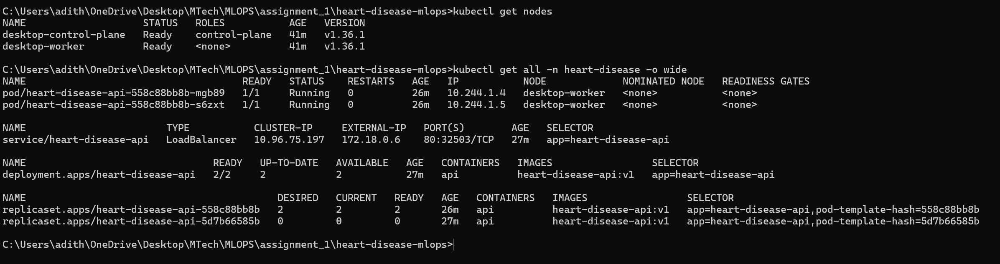
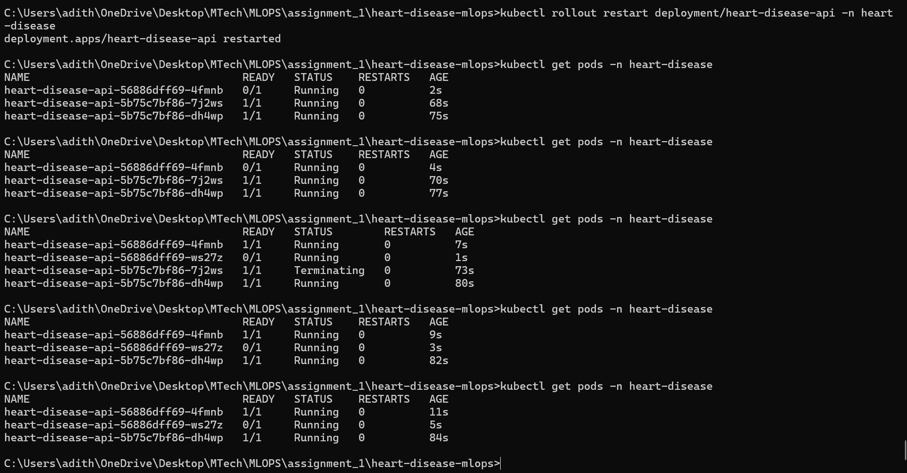

## 9. Monitoring & Logging

Every prediction request emits a structured application log line,
`heart_disease_api INFO predict prediction=<0|1> probability=<p>
latency_ms=<t>`, alongside uvicorn's own access log entry for the same
request. Together these give a human-readable audit trail and a stable,
greppable field format.

Beyond logging, the API exposes a `/metrics` endpoint via
`prometheus-fastapi-instrumentator` (standard HTTP request-rate, latency,
and status-code metrics) plus a custom domain counter,
`heart_disease_predictions_total{risk_label}`, incremented on every
prediction. This surfaces ML-aware signal, the mix of predicted classes
over time, not just HTTP plumbing. Prometheus and Grafana are deployed
into the same namespace, fully provisioned from ConfigMaps with a single
`kubectl apply`: Prometheus statically scrapes the API Service every 15s,
and Grafana (anonymous viewer access) serves a pre-built "Heart Disease
API" dashboard covering request rate, p50/p95 latency, non-2xx rate, and
predictions by risk label. Both are reachable via their own LoadBalancer
Services on 9090 and 3000. Live verification confirmed the Prometheus
scrape target `up`, PromQL queries returning non-zero request-rate and
prediction counts, and Grafana's health and dashboard endpoints both
healthy.

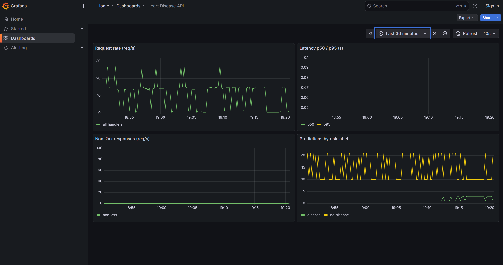

Watching the dashboard during a longer traffic session exposed a real
observability lesson. Prometheus initially scraped the API through its
load-balancing Service, so each scrape landed on a different pod and
returned that pod's independent counter. The series jumped between two
values, Prometheus read every downward jump as a counter reset, and the
rate panels inflated far beyond the true request volume. The fix was to
scrape each pod directly: a headless Service plus DNS-based service
discovery gives Prometheus one target per pod, per-pod counters stay
monotonic, and the summed panels now report true totals. The diagnosis
itself is recorded in the decision log; the takeaway is that scrape
topology is part of metric correctness, not just plumbing.

The monitoring stack, like the API deployment, is intentionally ephemeral:
no persistent volumes are used, so metrics reset whenever pods restart.
For a graded demo this is an acceptable, and arguably correct, trade-off.
See the conclusion.

## 10. Conclusion

Taken together, the pipeline demonstrates the full lifecycle asked for by
the assignment. The dataset is fetched and cleaned reproducibly. Feature
engineering is embedded in a pipeline instead of pre-computed. A tracked,
multi-model comparison reports honest, mixed results instead of a single
flattering number. Deterministic packaging lets a fresh clone serve
without retraining. A CI/CD gate is proven with both a green and a red
run. The container is slim and runs as non-root. The Kubernetes deployment
target was chosen for a documented account constraint, not convenience.
The monitoring stack is wired into real Prometheus and Grafana instead of
a stub JSON endpoint.

The ephemeral choices are deliberate: no EKS cluster is left running, no
persistent volumes back Prometheus/Grafana, and metrics reset with the
pods. This is cost-conscious practice, not a shortcut. Nothing here needs
to survive a demo, and provisioning everything declaratively (namespace,
Deployment, Service, and the monitoring ConfigMaps) means the entire stack
can be torn down and rebuilt with a couple of `kubectl apply`/`kubectl
delete` calls whenever it is needed again. That property, not continuous
uptime, is what matters for a project graded once.

If this pipeline were to continue past the assignment, the clearest next
steps follow directly from the trade-offs already documented. The tracked
model could move into MLflow's Model Registry once more than one model
needs to be managed over time. The monitoring stack could move onto
persistent storage with a per-pod scrape topology once metrics need to
survive a restart. EKS is worth revisiting once the account constraints
that forced the local-Kubernetes pivot are lifted. None of those are
required to satisfy the current rubric, but each is a natural,
low-friction extension of decisions already made, not a rearchitecture.
